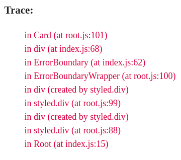

# react-bullet-holes

Awesome ErrorBoundary. Show errors of React components where they occurred. Based on componentDidCatch from React 16.


### Install

```bash
yarn add -D react-bullet-holes
```

or

```bash
npm install --save-dev react-bullet-holes
```

### Usage

```javascript
import React from 'react';
import ErrorBoundary from 'react-bullet-holes';

/../

render() {
  return (
    <div>
      <ErrorBoundary>
        <Card />
      </ErrorBoundary>
    </div>
  );
}

```

## Props

#### onError: func(error: { message: string, stack: string }, info: { componentStack: string })

This callback is called when throwing error in wrapped component.

## Tips & Tricks

For more detailed trace you can add [babel-plugin-transform-react-jsx-source](https://babeljs.io/docs/plugins/transform-react-jsx-source/)



After that in trace will be displayed exactly source file and line where error occurred.
